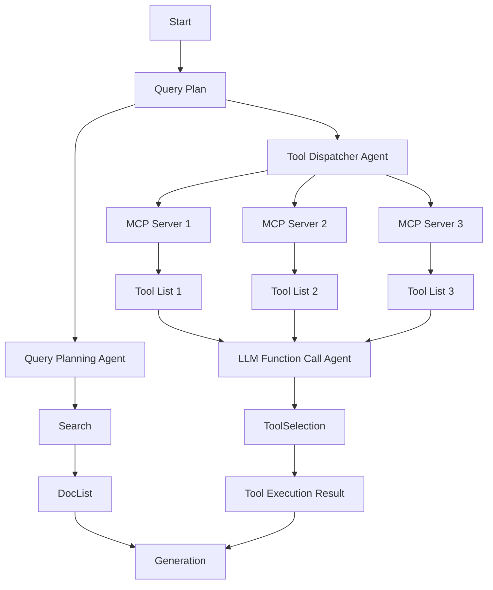

## Open MCP Marketplace | AI Agent Store Marketplace Index | OneKey MCP Router | AI Agent & MCP Moneytization Revenue Sharing plans | MCP Tool Use Agent from DeepNLP


[](https://www.deepnlp.org/store/mcp-server/mcp-server/pub-ai-agent-marketplace-index/ai-agent-marketplace-index) |
[](https://www.deepnlp.org/store/mcp-server/mcp-server/pub-ai-agent-marketplace-index/ai-agent-marketplace-index) |
[WeChat](https://raw.githubusercontent.com/aiagenta2z/mcp-marketplace/refs/heads/main/docs/mcp_marketplace_wechat_group.png)


Visit the website [MCP Tool Use Agent App](https://agent.deepnlp.org/agent/mcp_tool_use) to explore MCP Servers with sota agentic AI Search/Deep Research, Finance Data,Chart Creation, Excel Spreadsheet/Powerpoint usage.


**[MCP Open Marketplace and Search Engine](https://www.deepnlp.org/store/ai-agent/mcp-server)**<br>


**[MCP Tool Use Agent App](https://agent.deepnlp.org/agent/mcp_tool_use)**<br>


## Basic

Open MCP Marketplace is an open source project aims to make MCP Servers integration into your AI Agent Workflow **Easier**.

- **MCP Search Engine and Marketplace**: [MCP Marketplace Index](https://www.deepnlp.org/store/ai-agent/mcp-server) and [MCP Search Engine](https://www.deepnlp.org/search/agent)
- **MCP OneKey Router** Use Just One Access Key to Authenticate and Use commercial MCPs, AI Agent & MCP Moneytization Revenue Sharing plans: [OneKey MCP Router](https://github.com/aiagenta2z/OneKey-MCP-Router) introduction and proxy [Onekey MCP servers App](https://github.com/aiagenta2z/mcp-marketplace/tree/main/app/onekey_mcp_router).
- **MCP Server Tool Meta and Config**: You can get well-cleaned up MCP Servers Tools Meta information, Tools and Config Schema, etc. 
- **Web Based MCP Client with Admin Page**: Similar to Claude Desktop, Cursor, and many other clients, Open MCP-Marketplace provides a pured web based MCP client and Admin Page to connect(Start/End) and use MCP tools.
- **Agent ToolBox**: Explore, Search Various 11k+ MCP Servers from open mcp marketplace. You can also filter by category, such as official, browser use, map, finance, coding, office software usage, etc.
- **Various AI Agent Apps Support**: You can easily integrate the app into your existing Chatbot, AI Search/Deep Research Engine, Excel Spreadsheet/Powerpoint Creation, Video/Image generation, Coding IDE, etc. 
- **Public API Access**: Visit [API Documentation](http://deepnlp.org/doc/mcp-marketplace) to search related mcp server and tools by keywords, category and more.
- **MCP Tool Use Agent and Workflow App**: [MCP Tool Use Agent Source Code](https://github.com/aiagenta2z/mcp-marketplace/tree/main/app/mcp_tool_use)
- **Python/Typescript Package Support**: [Pypi](https://pypi.org/project/mcp-marketplace/), Npm


## News

- **CLI `mcpm`**: Command Line tool to start a python based MCP Client from your mcp_config.json, like cursor/Claude. Useful for MCP Benchmarking which provides rest APIs endpoint.
- **OneKey MCP Router**: Use OneKey to Access commercial MCPs. Visit [OneKey MCP Router](https://github.com/aiagenta2z/OneKey-MCP-Router) for details.
- **Upgraded: Office File Agent and Visualization Agent**: Excel spreadsheet data writing and data analysis agent, Powerpoint generation, Charts Creation. [Excel Spreadsheet Agent](https://agent.deepnlp.org/agent/mcp_tool_use?server=haris-musa/excel-mcp-server), [Visualization Agent](https://agent.deepnlp.org/agent/mcp_tool_use?server=antvis/mcp-server-chart)
- **Live MCP Tool Use Agent is Online**, Visit the [MCP Tool Use Agent App](https://agent.deepnlp.org/agent/mcp_tool_use) to see the workflows


## Example MCP Usage by Categories

| Domain | Related MCP Server|  Demo |
| ---- | ---- |  ----  |
| Office File Agent |  Excel Spreadsheet, Powerpoint, PDF, etc | [Example](https://agent.deepnlp.org/agent/mcp_tool_use/share/ee640008-6bc1-4c3a-832b-2557f985b540) [MCP]() |
| AI Search/Deep Research | Bing/Google Custom/Perplexity/Tavily/Firecrawl |  [Demo](https://agent.deepnlp.org/agent/mcp_tool_use?server=tavily-ai/tavily-mcp) [MCP]() |
| Map Trip Planning | GoogleMap, Amap(Gaode), BaiduMap, etc. | [Example](https://agent.deepnlp.org/agent/mcp_tool_use/share/8ab0b25c-b72d-4cae-9c86-a852df8c6541)  [MCP](https://agent.deepnlp.org/agent/mcp_tool_use?server=amap-mcp/amap-mcp-%E9%AB%98%E5%BE%B7%E5%9C%B0%E5%9B%BE-mcp) [Use MCP]() |
| Browser Usage | Playwright, Puppeteer, etc. |  [Demo](https://agent.deepnlp.org/agent/mcp_tool_use?server=puppeteer/puppeteer) [MCP]()  |
| Chart,Graph,Image | everart,mcp-server-charts(AntV),canva-mcp,bing-image-search-mcp |  [Example](https://agent.deepnlp.org/agent/mcp_tool_use/share/1a6101e0-9afa-47c4-828c-f3d373dc96f1) [MCP]() |

**Example: Route Planning using Google Map MCP**
```
q=Find the best route from JFK Airport to Times Square in New York
```


**Example: Office Agent Excel Spreadsheet and Powerpoint Creation Usage**
```
q=Write below information to an excel spreadsheet. Derek: male, graduated in years 2019, IT department, Jenifer: female graduated in 2024 Sales and Marketing department, Alan: male, graduated in 2021 in R&D department, Paul: mail, graduated in 2015, Staff in Operations department. Please formalize the data into three columns: name, graduation year and department. Then use spreadsheet formula to calculate the percentage of employees graduated within 3 years.
```


[Excel Spreadsheet and Powerpoint Office Agent](https://agent.deepnlp.org/agent/mcp_tool_use/share/36f34bd2-5527-40b7-9365-5f0c33fd5e22)


**Exmaple: Chart Plotting**

```
q=Plot a pie chart showing 25% of employees graduated within 3 years and 75% graduated more than 3 years ago.
```


[Excel Spreadsheet and Powerpoint Office Agent](https://agent.deepnlp.org/agent/mcp_tool_use/share/93d94694-e673-49d3-b805-820c4ef842bd)


**Example: AI Search Deep Research**

Visit [MCP Tool Use App](https://github.com/aiagenta2z/mcp-marketplace/tree/main/app/ai_search)


**Example: MCP Admin and Playground To Manage Tools and Servers**

Visit [MCP Tool Use App](https://github.com/aiagenta2z/mcp-marketplace/tree/main/app/mcp_tool_use)


## KEY Features

1. MCP Server Public Index of Tools Schema and Config file
Dataset Collection of MCP Servers Tool/Function Call Schemas from 5000+ MCP servers, Useful for Tools RAG, Tools Dispatcher research and R&D. You can search route planning or "map" keywords from raw schema files. Welcome to add your config to the index. [MCP Tool Schema](./tools/README.md)

2. MCP Marketplace Web Integration, See Web Demo and Video how to integrate the Open MCP Marketplace to Your AI Search Engine or Agent Workflow.

- **Pure Web-based Plugin** : Show the Panel of MCP Tools from available open MCP marketplace, Support Filtering, Search, Installation  <br>
- **Browse Navigate and Pagination** : User can browser the MCP Tools by category and use pagination to navigate. <br>
- **Customized MCP servers Selection and Installation** : Users can choose which MCP tools to perform tasks from mcp tools marketplace with similar features, such as Map Location, Search, Fetch, Payment, etc.  <br>
- **Badge**: Put Badge on your homepage Track MCP Servers User Reviews and Ratings, such as 

3. MCP API Endpoint Support for Your AI Client Development

- **Various MCP Marketplace API Endpoint**: Get Server Schema, Such as [pulsemcp.com](https://www.pulsemcp.com), [deepnlp.org](https://www.deepnlp.org), [aiagenta2z.com](https://www.aiagenta2z.com),etc. <br>
- **GET/UPDATE/CREATE** MCP Servers Meta information to get your MCP Server more visibilityy. <br>
- **Python and Typescript SDK** Search and registry of MCP Servers and Tools <br>
- **Rich Meta Data** Tools, Servers Description, URL, Category, Github stars, User reviews score, Ratings and more statistics. <br>

4. Agent Workflow of MCP Marketplace
- [**MCP Tools Dispatcher Agent**](#tool_dispatcher): The MCP Tool Dispatcher Agent helps to retrieve relevent tools from thousands of MCP servers and tools from marketplace, and reduce the context token length of function call LLM.

5. MCP Client support CLI `mcpm` to start mcp server From config file
- **Lightweight MCP Client**: Start the MCP Client just like cursor/Claude Desktop. (npx/python)
- **Benchmarking** : Support Rest APIs to run tool/call (Google-maps/perplexity/Deep Search Web clients,etc)


## 1. MCP Server Public Index of Tools Schema and <code>mcp.config</code> file

See [MCP Tool Schema](./tools/README.md) for details. 

Collected tools schema from google map mcp
```
{"name": "maps_geocode", "description": "Convert an address into geographic coordinates", "input_schema": {"type": "object", "properties": {"address": {"type": "string", "description": "The address to geocode"}}, "required": ["address"]}}
{"name": "maps_directions", "description": "Get directions between two points", "input_schema": {"type": "object", "properties": {"origin": {"type": "string", "description": "Starting point address or coordinates"}, "destination": {"type": "string", "description": "Ending point address or coordinates"}, "mode": {"type": "string", "description": "Travel mode (driving, walking, bicycling, transit)", "enum": ["driving", "walking", "bicycling", "transit"]}}, "required": ["origin", "destination"]}}

```

## 2. MCP Marketplace Web Client Integration

### MCP Tool Use Agent

MCP Marketplace Browse and Pagination of MCP Servers [Demo](https://agent.deepnlp.org/agent/mcp_tool_use)


## 3. Various API Endpoint Support for Your AI Client Development
### Supported MCP Marketplace API Provider

| Endpoint | API | Website |
| --- | ---- | ---- |
| deepnlp.org | https://www.deepnlp.org/api/mcp_marketplace/v1 | https://www.deepnlp.org/doc/mcp_marketplace |
| pulsemcp.com | https://api.pulsemcp.com/v0beta/servers | https://www.pulsemcp.com/api |


### Python and Typescript SDK

For official documentation of MCP Marketplace API, please check https://www.deepnlp.org/doc/mcp_marketplace
, [Python SDK](./python/README.md) and [Typescript SDK (WIP)]()

**Usage**

#### Search MCP Server 

Search MCP Server by Meta Information by unique id, query or category


```
import mcp_marketplace as mcpm

## endpoint: deepnlp
mcpm.set_endpoint("deepnlp")
result = mcpm.search(query="map", page_id=0, count_per_page=20, mode="dict")
print (result)

server_id = "financial-datasets/mcp-server"
result2 = mcpm.search(query="financial datasets", count_per_page=20, offset=0)
print (result2)

## Search By Unique ID:  e.g. github {owner_name}/{repo_name}
result_id = mcpm.search(id="puppeteer/puppeteer", mode="list", page_id=0, count_per_page=100, config_name="deepnlp")

# search by batch query
query_list = ["map", "navigation", "route planning"]
params_list = [{"query": query, "page_id":0, "count_per_page":50} for query in query_list]
results = mcpm.search_batch(params_list)

```

**Curl Endpoint**

```
curl https://www.deepnlp.org/api/mcp_marketplace/v1/server/google-maps/google-maps
```

**Result**

```
{
  "total_hits": 1,
  "id": "google-maps/google-maps",
  "items": [{
    "content_name": "Google Maps",
    "publisher_id": "pub-google-maps",
    "website": "https://github.com/modelcontextprotocol/servers/tree/main/src/google-maps",
    "review_cnt": "2",
    "rating": "4.5",
    "description": "Google Maps  Location services, directions, and place details\r\n\r\n# Google Maps MCP Server\r\n\r\nMCP Server for the Google Maps API.\r\n\r\n## Tools\r\n\r\n1. \\`maps_geocode\\`\r\n\r\n   - Convert address to coordinates\r\n   - Input: \\`address\\` (string)\r\n   - Returns: location, formatted_address, place_id\r\n\r\n2. \\`maps_reverse_geocode\\`\r\n\r\n   - Convert coordinates to address\r\n   - Inputs:\r\n     - \\`latitude\\` (numb",
    "ext_info": {
      "tools": []
    },
    "subfield": "MAP",
    "field": "MCP SERVER",
    "id": "google-maps/google-maps",
    "content_tag_list": "official",
    "config": [],
    "thumbnail_picture": "https://118.190.154.215/scripts/img/ai_service_content/b7fe82a3ab985ce1a953f7b4ad9c5e01.jpeg"
  }]
}
```


#### List Available Tools 
```

import mcp_marketplace as mcpm

server_id = "google-maps/google-maps"
result = mcpm.list_tools(id=server_id, config_name="deepnlp_tool")
    
server_id = "puppeteer/puppeteer"
result = mcpm.list_tools(id=server_id, config_name="deepnlp_tool")

```

**Curl Endpoint**

```
curl https://www.deepnlp.org/api/mcp_marketplace/v1/tools/google-maps/google-maps
```

```
{"id":"/google-maps/google-maps","tools":[{"name":"maps_geocode","description":"Convert an address into geographic coordinates","input_schema":{"type":"object","properties":{"address":{"type":"string","description":"The address to geocode"}},"required":["address"]}},{"name":"maps_reverse_geocode","description":"Convert coordinates into an address","input_schema":{"type":"object","properties":{"latitude":{"type":"number","description":"Latitude coordinate"},"longitude":{"type":"number","description":"Longitude coordinate"}},"required":["latitude","longitude"]}},{"name":"maps_search_places","description":"Search for places using Google Places API","input_schema":{"type":"object","properties":{"query":{"type":"string","description":"Search query"},"location":{"type":"object","properties":{"latitude":{"type":"number"},"longitude":{"type":"number"}},"description":"Optional center point for the search"},"radius":{"type":"number","description":"Search radius in meters (max 50000)"}},"required":["query"]}},{"name":"maps_place_details","description":"Get detailed information about a specific place","input_schema":{"type":"object","properties":{"place_id":{"type":"string","description":"The place ID to get details for"}},"required":["place_id"]}},{"name":"maps_distance_matrix","description":"Calculate travel distance and time for multiple origins and destinations","input_schema":{"type":"object","properties":{"origins":{"type":"array","items":{"type":"string"},"description":"Array of origin addresses or coordinates"},"destinations":{"type":"array","items":{"type":"string"},"description":"Array of destination addresses or coordinates"},"mode":{"type":"string","description":"Travel mode (driving, walking, bicycling, transit)","enum":["driving","walking","bicycling","transit"]}},"required":["origins","destinations"]}},{"name":"maps_elevation","description":"Get elevation data for locations on the earth","input_schema":{"type":"object","properties":{"locations":{"type":"array","items":{"type":"object","properties":{"latitude":{"type":"number"},"longitude":{"type":"number"}},"required":["latitude","longitude"]},"description":"Array of locations to get elevation for"}},"required":["locations"]}},{"name":"maps_directions","description":"Get directions between two points","input_schema":{"type":"object","properties":{"origin":{"type":"string","description":"Starting point address or coordinates"},"destination":{"type":"string","description":"Ending point address or coordinates"},"mode":{"type":"string","description":"Travel mode (driving, walking, bicycling, transit)","enum":["driving","walking","bicycling","transit"]}},"required":["origin","destination"]}}]}

```


#### List MCP Config files

**API**

```
GET /api/mcp_marketplace/v1/server/${owner_id}/${repo_name}
```


## Resources

### Badge

Put Badge on your homepage markdown to track MCP Servers User Reviews and Ratings, such as [](https://www.deepnlp.org/store/ai-agent/mcp-server/pub-google-maps/google-maps). 


change google-maps/google-maps to your MCP "owner_name"/"repo_name"
```
](https://www.deepnlp.org/store/ai-agent/mcp-server/pub-${owner_name}/${repo_name})

## google map
](https://www.deepnlp.org/store/ai-agent/mcp-server/pub-google-maps/google-maps)
```

## 4. Agent Workflow of MCP Marketplace<a id="tool_dispatcher"></a>


(WIP) Here is a diagram of how MCP Marketplace is integrated to your Agent Workflow




### 5. MCP Client `mcpm` CLI tool for Personal Use or Benchmark Purpose

**Installation**

You can install the command line `mcpm` from mcp-marketplace pypi package, and start a MCP Client using local 
`mcp_config.json` file

```
## Basic Usage MCP Index and Search
pip install mcp-marketplace

## MCPClient Supports User Defined mcp_config.json, Just Like Other Clients Cursor/Claude
pip install mcp-marketplace[mcp_tool_use] 
```

The CLI 'mcpm' will be in python path

``` 
mcp run --host 0.0.0.0 --port 5000

## Use Local Config File
cd python/tests

mcpm run --port 5000 --config "./mcp_config_onekey.json"

mcpm run --port 5000 --config "./mcp_config.json"

```

Then you can visit http://0.0.0.0:5000 for web console and 
http://0.0.0.0:5000/mcp for mcp management


#### Benchmark

You can also run various MCP benchmark using the rest API From the Client

| API | Description                                                                      |
| ---- |----------------------------------------------------------------------------------|
| /api/query | The endpoint which you can post the tool parameters to get the tool/call results |


**CURL Tests**

Once you started the service and run the target mcp server, you can run the tools calls through the REST API.

Let's say you want to post to server: <code>puppeteer</code> and test tools: <code>puppeteer_navigate</code> to navigate chrome to a webpage.

Endpoint: http://127.0.0.1:5000/api/query

```

curl -X POST -H "Content-Type: application/json" -d '{
    "server_id": "puppeteer",
    "tool_name": "puppeteer_navigate",
    "tool_input": {
        "url": "https://arxiv.org/list/cs/new"
    }
}' http://127.0.0.1:5000/api/query

```

Result 
```
{"success":true,"data":["Navigated to https://arxiv.org/list/cs/new"],"error":null}%
```


**REST GET/POST Request By Python/Typescript/etc**

For example, post request to MCP: amap-amap-sse, Tool: Get Weather and get local weather. You need to start mcp server 'amap-amap-sse' before running command line.

cd ./tests

```
python run_mcp_request.py

## define input_params
        input_params = {
            "server_id": "amap-amap-sse", 
            "tool_name": 'maps_weather',
            "tool_input": {
                "city": "乌鲁木齐"
            }
        }

```

Result
```
{'success': True, 'data': ['{"city":"乌鲁木齐市","forecasts":[{"date":"2025-06-30","week":"1","dayweather":"多云","nightweather":"多云","daytemp":"31","nighttemp":"20","daywind":"西北","nightwind":"西北","daypower":"1-3","nightpower":"1-3","daytemp_float":"31.0","nighttemp_float":"20.0"},{"date":"2025-07-01","week":"2","dayweather":"多云","nightweather":"多云","daytemp":"28","nighttemp":"20","daywind":"西北","nightwind":"西北","daypower":"1-3","nightpower":"1-3","daytemp_float":"28.0","nighttemp_float":"20.0"},{"date":"2025-07-02","week":"3","dayweather":"多云","nightweather":"多云","daytemp":"28","nighttemp":"20","daywind":"西北","nightwind":"西北","daypower":"1-3","nightpower":"1-3","daytemp_float":"28.0","nighttemp_float":"20.0"},{"date":"2025-07-03","week":"4","dayweather":"多云","nightweather":"晴","daytemp":"30","nighttemp":"21","daywind":"西北","nightwind":"西北","daypower":"1-3","nightpower":"1-3","daytemp_float":"30.0","nighttemp_float":"21.0"}]}'], 'error': None}
```


## Contribution

## Resources


- [MCP Marketplace DeepNLP](https://www.deepnlp.org/store/ai-agent/mcp-server)
- [MCP Marketplace PulseMCP](https://www.pulsemcp.com/)
- [AI Agent Marketplace](https://www.deepnlp.org/store/ai-agent)


