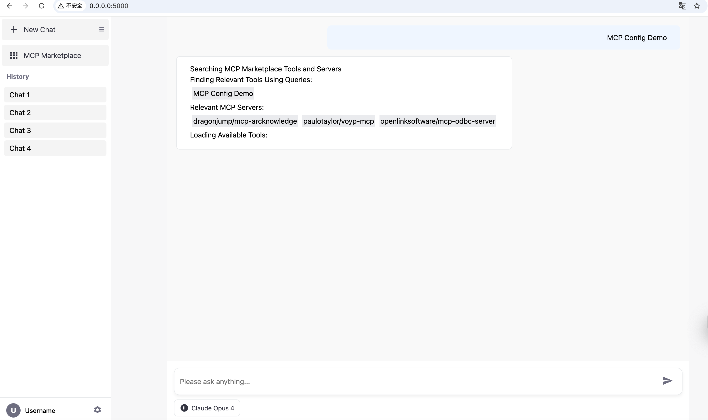
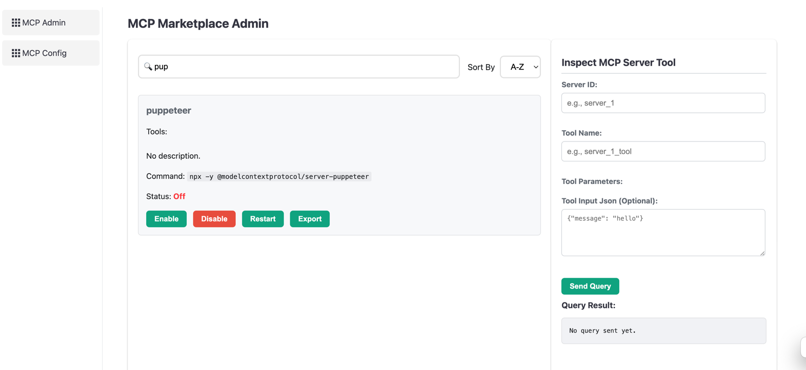

# MCP Marketplace Python SDK

MCP Marketplace Python Package is a common interface to give you access to public MCP Servers, Tools, Configurations. It supports various API endpoint (such as pulsemcp.com, deepnlp.org, etc).

[PyPI](https://www.pypi.org/project/mcp-marketplace)|[Document](http://www.deepnlp.org/doc/mcp_marketplace)|[MCP Marketplace](http://www.deepnlp.org/store/ai-agent/mcp-server)|[AI Agent Search](http://www.deepnlp.org/search/agent)|[MCP Router Ranking List](https://www.deepnlp.org/agent/rankings)

### Features

0. A Lightweight MCP Client (Like Cursor,Claude) and CLI `mcpm` for personal use and benchmarking tools/LLMs
1. Search API of MCP Tools: Users can search MCP Servers Meta Info and tools fit for mcp.json by query, such as "map", "payment", "browser use"
2. List MCP Tools API: And Allow LLM and AI Apps to Find Your MCP Server
3. Load MCP Config: Get latest mcp_config.json files
4. Development Customized API and Endpoint to Support Your Local MCP Marketplace API or Services
5. Registry: Allow Users to register the MCP Marketplace create, delete, update their MCP servers through various endpoints. (WIP)

### 0. Start MCP Client using `mcpm` CLI tool for Personal Use or Benchmark Purposes

**Installation**

You can install the command line `mcpm` tool from mcp-marketplace pypi package, and start a MCP Client using local 
`mcp_config.json` file

```
## Basic Usage MCP Index and Search
pip install mcp-marketplace

## MCPClient Supports User Defined mcp_config.json, Just Like Other Clients Cursor/Claude
pip install 'mcp-marketplace[mcp_tool_use]'

```

Install From GitHub Source
```angular2html
git clone https://github.com/aiagenta2z/mcp-marketplace
cd mcp-marketplace/python
pip install -e .

## Missing Dependency, Please report to use via issues
```

The CLI 'mcpm' will be in python path

``` 
mcpm run
mcpm run --host 0.0.0.0 --port 5000

## Use Local Config File, Go To GitHub Get the config https://github.com/aiagenta2z/mcp-marketplace

cd python/tests

mcpm run --port 5000 --config "./mcp_config_onekey.json"

mcpm run --port 5000 --config "./mcp_config.json"

```

Visit http://0.0.0.0:5000 for ChatUI


Visit http://0.0.0.0:5000/mcp for mcp management




#### Benchmark

You can also run various MCP benchmark using the rest API From the Client

| API | Description                                                                      |
| ---- |----------------------------------------------------------------------------------|
| /api/query | The endpoint which you can post the tool parameters to get the tool/call results |


**CURL Tests**

Once you started the service and run the target mcp server, you can run the tools calls through the REST API.

Let's say you want to post to server: <code>puppeteer</code> and test tools: <code>puppeteer_navigate</code> to navigate chrome to a webpage.

Endpoint: http://127.0.0.1:5000/api/query

```

curl -X POST -H "Content-Type: application/json" -d '{
    "server_id": "puppeteer",
    "tool_name": "puppeteer_navigate",
    "tool_input": {
        "url": "https://arxiv.org/list/cs/new"
    }
}' http://127.0.0.1:5000/api/query

```

Result 
```
{"success":true,"data":["Navigated to https://arxiv.org/list/cs/new"],"error":null}%
```


**REST GET/POST Request By Python/Typescript/etc**

For example, post request to MCP: amap-amap-sse, Tool: Get Weather and get local weather. You need to start mcp server 'amap-amap-sse' before running command line.

cd ./tests

```
python run_mcp_request.py

## define input_params
        input_params = {
            "server_id": "amap-amap-sse", 
            "tool_name": 'maps_weather',
            "tool_input": {
                "city": "乌鲁木齐"
            }
        }

```

Result
```
{'success': True, 'data': ['{"city":"乌鲁木齐市","forecasts":[{"date":"2025-06-30","week":"1","dayweather":"多云","nightweather":"多云","daytemp":"31","nighttemp":"20","daywind":"西北","nightwind":"西北","daypower":"1-3","nightpower":"1-3","daytemp_float":"31.0","nighttemp_float":"20.0"},{"date":"2025-07-01","week":"2","dayweather":"多云","nightweather":"多云","daytemp":"28","nighttemp":"20","daywind":"西北","nightwind":"西北","daypower":"1-3","nightpower":"1-3","daytemp_float":"28.0","nighttemp_float":"20.0"},{"date":"2025-07-02","week":"3","dayweather":"多云","nightweather":"多云","daytemp":"28","nighttemp":"20","daywind":"西北","nightwind":"西北","daypower":"1-3","nightpower":"1-3","daytemp_float":"28.0","nighttemp_float":"20.0"},{"date":"2025-07-03","week":"4","dayweather":"多云","nightweather":"晴","daytemp":"30","nighttemp":"21","daywind":"西北","nightwind":"西北","daypower":"1-3","nightpower":"1-3","daytemp_float":"30.0","nighttemp_float":"21.0"}]}'], 'error': None}
```

### Install

```
pip install mcp-marketplace

```

Dependency 

```
pip install uvicorn mcp fastapi pydantic dotenv asyncio httpx mcp_marketplace uuid aiofiles logger anthropic jinja2
```


### 1. Search API of MCP Tools

**Usage**

Example 1. Search MCP Marketplace By Query or Server ID

The server id follows the same in the github repo ${owner}/${repo}

```

import mcp_marketplace as mcpm

## endpoint: deepnlp
mcpm.set_endpoint("deepnlp")
result = mcpm.search(query="map", page_id=0, count_per_page=20, mode="dict")

print ("DEBUG: run_setup_config_deepnlp result:")
print (result)


## endpoint: pulsemcp
mcpm.set_endpoint("pulsemcp")
result2 = mcpm.search(query="map", count_per_page=20, offset=0)

print ("DEBUG: run_setup_config_pulsemcp result:")
print (result2)

```


**MCP Result**

```

{
  "q": "map",
  "limit": 50,
  "items": [
    {
        "id": "",
        "content_name": "Google Maps",
        "publisher_id": "pub-google-maps",
        "website": "https://github.com/modelcontextprotocol/servers/tree/main/src/google-maps",
        "review_cnt": "1",
        "subfield": "MAP",
        "field": "MCP SERVER",
        "rating": "5.0",
        "description": "",
        "content_tag_list": "official",
        "thumbnail_picture": "http://118.190.154.215/scripts/img/ai_service_content/b7fe82a3ab985ce1a953f7b4ad9c5e01.jpeg"
    },    
  ]
}
```


### 2. List MCP Tools API

 
Example 2. List Tools of MCP Servers  <code>list_tools</code> method


Let's choose the unique id of browser use mcp "/puppeteer/puppeteer". And we can search the MCP meta and list the tools as below.

```
    import mcp_marketplace as mcpm
        
    result_q = mcpm.search(query="browser use", mode="list", page_id=0, count_per_page=100, config_name="deepnlp")
    result_id = mcpm.search(id="/puppeteer/puppeteer", mode="list", page_id=0, count_per_page=100, config_name="deepnlp")
    tools = mcpm.list_tools(id="/puppeteer/puppeteer", config_name="deepnlp_tool")

    print (f'{result_id}')
    print (f'{tools}')
```

Example 2.1 List Batch Tools of MCP Servers  <code>list_tools_batch</code> method

Let's choose the unique id of browser use mcp "/puppeteer/puppeteer". And we can search the MCP meta and list the tools as below.

```
    import mcp_marketplace as mcpm
        
    servers_ids = ["puppeteer/puppeteer", "google-maps/google-maps"]
    query_params_list = [{"id": server_id, "config_name": "deepnlp_tool"} for server_id in server_ids]
    batch_tools_result = mcpm.list_tools_batch(query_params_list)
    print (f'DEBUG: list_tools_batch servers_ids {servers_ids}')
    print (f'DEBUG: list_tools_batch batch_tools_result {batch_tools_result}')

```


### 3. Load MCP Config 

Example 3.1 <code>load_config_batch</code> Method


```
    import mcp_marketplace as mcpm
    server_ids = ["puppeteer/puppeteer", "mendableai/firecrawl-mcp-server", "google-maps/google-maps"]
    mcp_config_result = mcpm.load_config_batch(server_ids, config_name="deepnlp_server")
    print (mcp_config_result)

```


### 4. Development Customized API and Endpoint

If you have MCP server APIs and want to customized the mcp_marketplace lib. You can pass the get_customized_url() function to the lib

The get_customized_url method assemble the endpoint and your id in a customized way and will post request to your Endpoint.

```
def customized_client():


    def get_customized_url(**param):
        id_value = param["id"] if "id" in param else ""
        base_url = param["endpoint"] if "endpoint" in param else ""
        return base_url + "/" + id_value
    
    mcpm.set_endpoint("http://www.deepnlp.org/api/mcp_marketplace/v1/tools")
    mcpm.get_customized_endpoint = get_customized_url
    
    ## **param: {"id": "puppeteer/puppeteer", "endpoint":"your_endpoint"}
    tools = mcpm.list_tools(id="puppeteer/puppeteer", endpoint=mcpm.endpoint)

```


### 5. Registry


### 6. OneKey MCP Router
This is a simple example of using python client to call google-maps mcps to get_maps_direction from maps_direction from 'Boston' to 'New York' driving
For complete list of MCPs and server_name, refer the docs: https://www.deepnlp.org/doc/onekey_mcp_router

```
def run_mcp_router_api_example():
    """
        # 1. This Function Connects to Google-Maps MCPs and run maps_direction from 'Boston' to 'New York' via driving
        # 2. Complete List of Supported Tools Use Check : https://www.deepnlp.org/doc/onekey_mcp_router
    """
    from mcp_marketplace import OneKeyMCPRouter
    
    example = {"server_name":"google-maps","tool_name":"maps_directions","tool_input":{"destination":"New York","mode":"driving","origin":"Boston"}}
    server_name = example.get("server_name", "")

    ## 1. MCP Initialize POST Request
    ONEKEY_BETA = "BETA_TEST_KEY_OCT_2025"
    router = OneKeyMCPRouter(server_name=server_name, onekey=ONEKEY_BETA)

    ## 2. Check Available Tools, tools/list
    available_tools = router.tools_list(server_name)
    print (f"Server {server_name}|available_tools {available_tools}")

    ## Your LLM Code

    ## 3. Run Tool, Post tools/call request
    result_json = router.tools_call(server_name, example.get("tool_name", ""), example.get("tool_input", {}))
    print (f"Server {server_name}|tool_name {example.get("tool_name", "")} | tool_input {example.get("tool_input", {})} |result_json {result_json}")

```

Result
```
Server google-maps|available_tools {'result': {'tools': [{'name': 'maps_geocode', 'description': 'Convert an address into geographic coordinates', 'inputSchema': {'type': 'object', 'properties': {'address': {'type': 'string', 'description': 'The address to geocode'}}, 'required': ['address']}}, {'name': 'maps_reverse_geocode', 'description': 'Convert coordinates into an address', 'inputSchema': {'type': 'object', 'properties': {'latitude': {'type': 'number', 'description': 'Latitude coordinate'}, 'longitude': {'type': 'number', 'description': 'Longitude coordinate'}}, 'required': ['latitude', 'longitude']}}, {'name': 'maps_search_places', 'description': 'Search for places using Google Places API', 'inputSchema': {'type': 'object', 'properties': {'query': {'type': 'string', 'description': 'Search query'}, 'location': {'type': 'object', 'properties': {'latitude': {'type': 'number'}, 'longitude': {'type': 'number'}}, 'description': 'Optional center point for the search'}, 'radius': {'type': 'number', 'description': 'Search radius in meters (max 50000)'}}, 'required': ['query']}}, {'name': 'maps_place_details', 'description': 'Get detailed information about a specific place', 'inputSchema': {'type': 'object', 'properties': {'place_id': {'type': 'string', 'description': 'The place ID to get details for'}}, 'required': ['place_id']}}, {'name': 'maps_distance_matrix', 'description': 'Calculate travel distance and time for multiple origins and destinations', 'inputSchema': {'type': 'object', 'properties': {'origins': {'type': 'array', 'items': {'type': 'string'}, 'description': 'Array of origin addresses or coordinates'}, 'destinations': {'type': 'array', 'items': {'type': 'string'}, 'description': 'Array of destination addresses or coordinates'}, 'mode': {'type': 'string', 'description': 'Travel mode (driving, walking, bicycling, transit)', 'enum': ['driving', 'walking', 'bicycling', 'transit']}}, 'required': ['origins', 'destinations']}}, {'name': 'maps_elevation', 'description': 'Get elevation data for locations on the earth', 'inputSchema': {'type': 'object', 'properties': {'locations': {'type': 'array', 'items': {'type': 'object', 'properties': {'latitude': {'type': 'number'}, 'longitude': {'type': 'number'}}, 'required': ['latitude', 'longitude']}, 'description': 'Array of locations to get elevation for'}}, 'required': ['locations']}}, {'name': 'maps_directions', 'description': 'Get directions between two points', 'inputSchema': {'type': 'object', 'properties': {'origin': {'type': 'string', 'description': 'Starting point address or coordinates'}, 'destination': {'type': 'string', 'description': 'Ending point address or coordinates'}, 'mode': {'type': 'string', 'description': 'Travel mode (driving, walking, bicycling, transit)', 'enum': ['driving', 'walking', 'bicycling', 'transit']}}, 'required': ['origin', 'destination']}}]}, 'jsonrpc': '2.0', 'id': '2'}
Server google-maps|tool_name maps_directions | tool_input {'destination': 'New York', 'mode': 'driving', 'origin': 'Boston'} |result_json {'jsonrpc': '2.0', 'result': {'success': True, 'content': [{'type': 'text', 'text': '{\n  "routes": [\n    {\n      "summary": "I-90 W",\n      "distance": {\n        "text": "214 mi",\n        "value": 344980\n      },\n      "duration": {\n        "text": "3 hours 45 mins",\n        "value": 13480\n      },\n      "steps": [\n        {\n          "instructions": "Head <b>north</b> on <b>Federal St</b> toward <b>Milk St</b>",\n          "distance": {\n            "text": "469 ft",\n            "value": 143\n          },\n          "duration": {\n            "text": "1 min",\n            "value": 47\n          },\n          "travel_mode": "DRIVING"\n        },\n        {\n          "instructions": "Turn <b>right</b> onto <b>Milk St</b>",\n          "distance": {\n            "text": "118 ft",\n            "value": 36\n          },\n          "duration": {\n            "text": "1 min",\n            "value": 18\n          },\n          "travel_mode": "DRIVING"\n        },\n        {\n          "instructions": "Turn <b>right</b> at the 1st cross street onto <b>Congress St</b>",\n          "distance": {\n            "text": "0.2 mi",\n            "value": 355\n          },\n          "duration": {\n            "text": "1 min",\n            "value": 79\n          },\n          "travel_mode": "DRIVING"\n        },\n        {\n          "instructions": "Turn <b>right</b> onto <b>Purchase St</b>",\n          "distance": {\n            "text": "89 ft",\n            "value": 27\n          },\n          "duration": {\n            "text": "1 min",\n            "value": 6\n          },\n          "travel_mode": "DRIVING"\n        },\n        {\n          "instructions": "Take the <b>I-93 S</b> ramp on the <b>left</b> to <b>I-90 W</b>/<wbr/><b>Quincy</b>/<wbr/><b>Worcester</b>",\n          "distance": {\n            "text": "0.5 mi",\n            "value": 749\n          },\n          "duration": {\n            "text": "1 min",\n            "value": 62\n          },\n          "travel_mode": "DRIVING"\n        },\n        {\n          "instructions": "Take the <b>I-90 W</b> ramp",\n          "distance": {\n            "text": "0.1 mi",\n            "value": 189\n          },\n          "duration": {\n            "text": "1 min",\n            "value": 12\n          },\n          "travel_mode": "DRIVING"\n        },\n        {\n          "instructions": "Take the <b>Route 90 W</b> ramp to <b>Masspike</b>/<wbr/><b>Worcester</b>",\n          "distance": {\n            "text": "0.2 mi",\n            "value": 307\n          },\n          "duration": {\n            "text": "1 min",\n            "value": 20\n          },\n          "travel_mode": "DRIVING"\n        },\n        {\n          "instructions": "Merge onto <b>I-90 W</b><div style=\\"font-size:0.9em\\">Toll road</div>",\n          "distance": {\n            "text": "55.2 mi",\n            "value": 88825\n          },\n          "duration": {\n            "text": "53 mins",\n            "value": 3154\n          },\n          "travel_mode": "DRIVING"\n        },\n        {\n          "instructions": "Take exit <b>78</b> for <b>I-84</b> toward <b>Hartford Connecticut</b>/<wbr/><b>N.Y.City</b><div style=\\"font-size:0.9em\\">Toll road</div>",\n          "distance": {\n            "text": "0.7 mi",\n            "value": 1139\n          },\n          "duration": {\n            "text": "1 min",\n            "value": 49\n          },\n          "travel_mode": "DRIVING"\n        },\n        {\n          "instructions": "Continue onto <b>I-84</b><div style=\\"font-size:0.9em\\">Toll road</div><div style=\\"font-size:0.9em\\">Entering Connecticut</div>",\n          "distance": {\n            "text": "40.9 mi",\n            "value": 65866\n          },\n          "duration": {\n            "text": "36 mins",\n            "value": 2141\n          },\n          "travel_mode": "DRIVING"\n        },\n        {\n          "instructions": "Take exit <b>57</b> on the <b>left</b> for <b>CT-15 S</b> toward <b>I-91 S</b>/<wbr/><b>Charter Oak Bridge</b>/<wbr/><b>N.Y.City</b>",\n          "distance": {\n            "text": "0.6 mi",\n            "value": 899\n          },\n          "duration": {\n            "text": "1 min",\n            "value": 32\n          },\n          "travel_mode": "DRIVING"\n        },\n        {\n          "instructions": "Continue onto <b>CT-15 S</b>",\n          "distance": {\n            "text": "0.5 mi",\n            "value": 874\n          },\n          "duration": {\n            "text": "1 min",\n            "value": 32\n          },\n          "travel_mode": "DRIVING"\n        },\n        {\n          "instructions": "Continue onto <b>CT-15 S</b>/<wbr/><b>US-5 S</b>",\n          "distance": {\n            "text": "0.8 mi",\n            "value": 1310\n          },\n          "duration": {\n            "text": "1 min",\n            "value": 50\n          },\n          "travel_mode": "DRIVING"\n        },\n        {\n          "instructions": "Take the exit onto <b>I-91 S</b>",\n          "distance": {\n            "text": "17.1 mi",\n            "value": 27465\n          },\n          "duration": {\n            "text": "15 mins",\n            "value": 928\n          },\n          "travel_mode": "DRIVING"\n        },\n        {\n          "instructions": "Take exit <b>17</b> to merge onto <b>CT-15 S</b>",\n          "distance": {\n            "text": "30.2 mi",\n            "value": 48619\n          },\n          "duration": {\n            "text": "28 mins",\n            "value": 1699\n          },\n          "travel_mode": "DRIVING"\n        },\n        {\n          "instructions": "Take exit <b>34</b> for <b>State Rte 8 S</b>/<wbr/><b>State Rte 108</b> toward <b>Bridgeport</b>",\n          "distance": {\n            "text": "0.6 mi",\n            "value": 1033\n          },\n          "duration": {\n            "text": "1 min",\n            "value": 48\n          },\n          "travel_mode": "DRIVING"\n        },\n        {\n          "instructions": "Merge onto <b>CT-8 S</b>/<wbr/><b>State Rte 8 S</b> via the ramp to <b>Bridgeport</b>",\n          "distance": {\n            "text": "5.3 mi",\n            "value": 8493\n          },\n          "duration": {\n            "text": "5 mins",\n            "value": 313\n          },\n          "travel_mode": "DRIVING"\n        },\n        {\n          "instructions": "Take exit <b>1B</b> to merge onto <b>I-95 S</b> toward <b>N.Y. City</b><div style=\\"font-size:0.9em\\">Entering New York</div>",\n          "distance": {\n            "text": "45.2 mi",\n            "value": 72822\n          },\n          "duration": {\n            "text": "49 mins",\n            "value": 2936\n          },\n          "travel_mode": "DRIVING"\n        },\n        {\n          "instructions": "Keep <b>right</b> to stay on <b>I-95 S</b>, follow signs for <b>Triboro Brg</b>/<wbr/><b>Geo Washington Brg</b>",\n          "distance": {\n            "text": "0.6 mi",\n            "value": 1001\n          },\n          "duration": {\n            "text": "1 min",\n            "value": 45\n          },\n          "travel_mode": "DRIVING"\n        },\n        {\n          "instructions": "Keep <b>left</b> to continue on <b>I-278 W</b>, follow signs for <b>Robert F. Kennedy Brg</b>/<wbr/><b>Manhattan</b>",\n          "distance": {\n            "text": "4.7 mi",\n            "value": 7618\n          },\n          "duration": {\n            "text": "6 mins",\n            "value": 370\n          },\n          "travel_mode": "DRIVING"\n        },\n        {\n          "instructions": "Keep <b>left</b> to stay on <b>I-278 W</b>, follow signs for <b>Triboro Br</b>/<wbr/><b>Manhattan</b>/<wbr/><b>Queens</b><div style=\\"font-size:0.9em\\">Toll road</div>",\n          "distance": {\n            "text": "0.7 mi",\n            "value": 1066\n          },\n          "duration": {\n            "text": "1 min",\n            "value": 68\n          },\n          "travel_mode": "DRIVING"\n        },\n        {\n          "instructions": "Take exit <b>46</b> toward <b>Manhattan</b><div style=\\"font-size:0.9em\\">Toll road</div>",\n          "distance": {\n            "text": "0.2 mi",\n            "value": 262\n          },\n          "duration": {\n            "text": "1 min",\n            "value": 18\n          },\n          "travel_mode": "DRIVING"\n        },\n        {\n          "instructions": "Merge onto <b>Robert F. Kennedy Brg</b><div style=\\"font-size:0.9em\\">Toll road</div>",\n          "distance": {\n            "text": "0.4 mi",\n            "value": 670\n          },\n          "duration": {\n            "text": "1 min",\n            "value": 44\n          },\n          "travel_mode": "DRIVING"\n        },\n        {\n          "instructions": "Take the <b>FDR Dr S</b> exit<div style=\\"font-size:0.9em\\">Toll road</div>",\n          "distance": {\n            "text": "0.4 mi",\n            "value": 668\n          },\n          "duration": {\n            "text": "1 min",\n            "value": 48\n          },\n          "travel_mode": "DRIVING"\n        },\n        {\n          "instructions": "Continue onto <b>FDR Dr</b>",\n          "distance": {\n            "text": "7.9 mi",\n            "value": 12792\n          },\n          "duration": {\n            "text": "13 mins",\n            "value": 776\n          },\n          "travel_mode": "DRIVING"\n        },\n        {\n          "instructions": "Take exit <b>2</b> toward <b>Manhattan Civic Ctr</b><div style=\\"font-size:0.9em\\">Toll road</div>",\n          "distance": {\n            "text": "0.1 mi",\n            "value": 237\n          },\n          "duration": {\n            "text": "1 min",\n            "value": 24\n          },\n          "travel_mode": "DRIVING"\n        },\n        {\n          "instructions": "Merge onto <b>Robert F. Wagner Sr. Pl</b>",\n          "distance": {\n            "text": "256 ft",\n            "value": 78\n          },\n          "duration": {\n            "text": "1 min",\n            "value": 22\n          },\n          "travel_mode": "DRIVING"\n        },\n        {\n          "instructions": "Turn <b>right</b> onto <b>Pearl St</b><div style=\\"font-size:0.9em\\">Toll road</div>",\n          "distance": {\n            "text": "351 ft",\n            "value": 107\n          },\n          "duration": {\n            "text": "1 min",\n            "value": 34\n          },\n          "travel_mode": "DRIVING"\n        },\n        {\n          "instructions": "Continue onto <b>St James Pl</b>",\n          "distance": {\n            "text": "0.2 mi",\n            "value": 313\n          },\n          "duration": {\n            "text": "2 mins",\n            "value": 108\n          },\n          "travel_mode": "DRIVING"\n        },\n        {\n          "instructions": "Turn <b>left</b> onto <b>Worth St</b>",\n          "distance": {\n            "text": "0.3 mi",\n            "value": 484\n          },\n          "duration": {\n            "text": "2 mins",\n            "value": 142\n          },\n          "travel_mode": "DRIVING"\n        },\n        {\n          "instructions": "Turn <b>left</b> onto <b>Federal Plaza</b>/<wbr/><b>Lafayette St</b><div style=\\"font-size:0.9em\\">Continue to follow Lafayette St</div>",\n          "distance": {\n            "text": "0.1 mi",\n            "value": 223\n          },\n          "duration": {\n            "text": "1 min",\n            "value": 59\n          },\n          "travel_mode": "DRIVING"\n        },\n        {\n          "instructions": "Continue onto <b>Centre St</b>",\n          "distance": {\n            "text": "0.1 mi",\n            "value": 229\n          },\n          "duration": {\n            "text": "1 min",\n            "value": 79\n          },\n          "travel_mode": "DRIVING"\n        },\n        {\n          "instructions": "Merge onto <b>Park Row</b>",\n          "distance": {\n            "text": "66 ft",\n            "value": 20\n          },\n          "duration": {\n            "text": "1 min",\n            "value": 5\n          },\n          "travel_mode": "DRIVING"\n        },\n        {\n          "instructions": "Turn <b>right</b><div style=\\"font-size:0.9em\\">Partial restricted usage road</div>",\n          "distance": {\n            "text": "200 ft",\n            "value": 61\n          },\n          "duration": {\n            "text": "1 min",\n            "value": 12\n          },\n          "travel_mode": "DRIVING"\n        }\n      ]\n    }\n  ]\n}'}]}, 'id': '4'}

```


## API Configuration

### Support Endpoint

| Endpoint | API |  Document  |
| ---- | ---- | ---- |
| http://www.deepnlp.org/api/mcp_marketplace/v1 | http://www.deepnlp.org/api/mcp_marketplace/v1?mode=list&query=map&page_id=0&count_per_page=100 | - |
| https://api.pulsemcp.com/v0beta/servers | https://api.pulsemcp.com/v0beta/servers?query=image&count_per_page=10 | https://www.pulsemcp.com/api |

### deepnlp.org


```

# list mode return paginated list
http://www.deepnlp.org/api/mcp_marketplace/v1?mode=list&query=map&page_id=0

http://www.deepnlp.org/api/mcp_marketplace/v1?mode=list&query=map&page_id=0&count_per_page=100

http://www.deepnlp.org/api/mcp_marketplace/v1?mode=list&query=map&offset=50&count_per_page=5


# dict mode return dict group by category

http://www.deepnlp.org/api/mcp_marketplace/v1?mode=dict&query=map&page_id=0

http://www.deepnlp.org/api/mcp_marketplace/v1?mode=dict&query=map&page_id=0&count_per_page=5

http://www.deepnlp.org/api/mcp_marketplace/v1?mode=dict&query=map&offset=50&count_per_page=5


# List Tools

http://www.deepnlp.org/api/mcp_marketplace/v1/tools/puppeteer/puppeteer

```


**Parameter**
| param | type | example |
| --- | ---- |  ---- | 
| mode |  string | "list", "dict", different use scenario |
| query |  string | e.g. query="Image" |
| page_id | integer | starting from 0 |
| count_per_page | integer |  5 |
| offset | integer | Optional, Equivalent to (page_id * count_per_page) e.g. 0 |


### pulsemcp.com

```
## query API
https://api.pulsemcp.com/v0beta/servers?query=image&count_per_page=10

## List API

https://api.pulsemcp.com/v0beta/servers
```

**Parameter**

| param | type | example |
| --- | ---- |  ---- | 
| query |  string | e.g. query="Image" |
| count_per_page | integer |  5 |
| offset | integer | Equivalent to (page_id * count_per_page) e.g. 0 |


### Related
- [MCP Marketplace DeepNLP](http://deepnlp.org/store/ai-agent/mcp-server)
- [MCP Marketplace PulseMCP](https://www.pulsemcp.com/)
- [Pypi](https://pypi.org/project/mcp-marketplace)
- [Github](https://github.com/aiagenta2z/mcp-marketplace)
- [AI Agent Marketplace](http://www.deepnlp.org/store/ai-agent)


