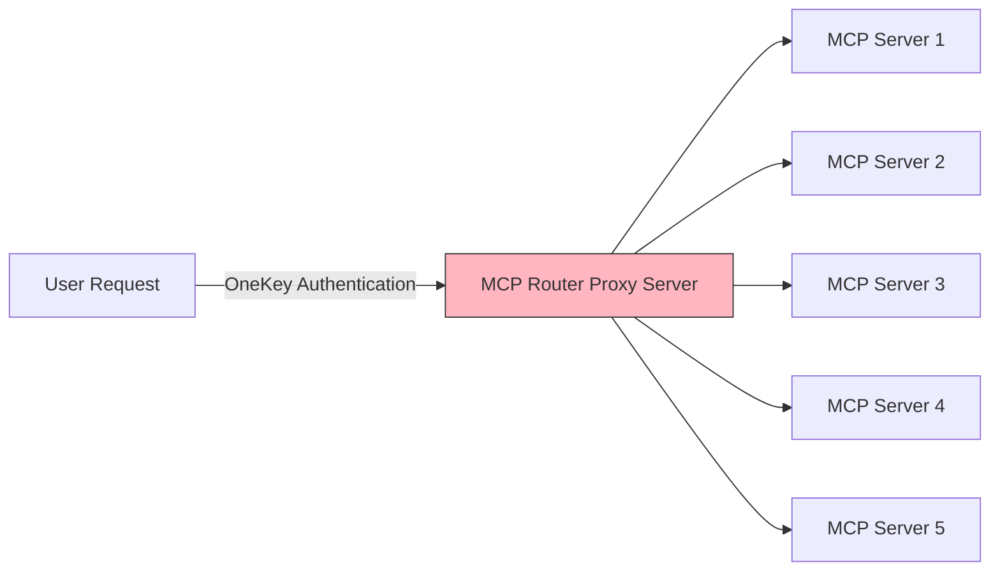

## DeepNLP OneKey MCP Router to Access Commercial MCP servers | MCPs AI Agent Revenue Sharing Initiative 

OneKey MCP Router is an proxy MCP servers supports streaming http services and help authenticate various commercial or non-commercial MCPs using one access key for MCPs.
Calling MCPs or AI Agent APIs by the credit system will reduce the costs of plans (Google Maps/Google Search/Other Web Search services/Financial Data) by a large margin and gain discount.

[OneKey MCP Website](https://www.deepnlp.org/agent/onekey_mcp_router) | [Agent Web Portal](https://agent.deepnlp.org)

**Features**
1. **OneKey Access**: Use just one key to access commercial and non-Commercial MCP servers via Proxy Router for free tier and discounted rates, without needs to registered all keys for each indivisual servers
2. **Streamable Http Based MCP Server**: The OneKey Access to Proxy MCP Server via Http Connection without the needs for local registered such as pyhon or nodejs.
3. **Authentication**: of various MCP or AI Agent service provides 
4. **Revenue Sharing Initiative** : Support MCP APIs and AI Agents Moneytization By Credit System, Gain Credit By comments and Publishing to Save Cost.




Source Code of MCP Onekey Proxy Server visit Github (https://github.com/aiagenta2z/mcp-marketplace)


## MCP Servers Supported By OneKey MCP Router


### QuickStart

1. **Generate Keys**: Your DeepNLP OneKey Router AccessKey in [OneKey Generation](https://www.deepnlp.org/agent/onekey_mcp_router)

or 

Use the beta Test Keys Below with limited call number

```
DEEPNLP_ONEKEY_ROUTER_ACCESS=BETA_TEST_KEY_OCT_2025 
```

2. **Setup Config**: Setup MCP config in your client, Cursor, VSCode or Other Clients.

Setup Environemnt Viariables
```
export DEEPNLP_ONEKEY_ROUTER_ACCESS=BETA_TEST_KEY_OCT_2025 
```

3. **Add config**: Add below config to mcp.config files

```
{
	"mcpServers": {
		"deepnlp-onekey-google-maps": {
			"url": "https://agent.deepnlp.org/mcp?server_name=google-maps&onekey={DEEPNLP_ONEKEY_ROUTER_ACCESS}"
		},
		"deepnlp-onekey-amap-maps": {
			"url": "https://agent.deepnlp.org/mcp?server_name=amap-maps-streamableHTTP&onekey={DEEPNLP_ONEKEY_ROUTER_ACCESS}"
		},
		"deepnlp-onekey-baidu-map": {
			"url": "https://agent.deepnlp.org/mcp?server_name=baidu-map&onekey={DEEPNLP_ONEKEY_ROUTER_ACCESS}"
		},
		"deepnlp-onekey-puppeteer": {
			"url": "https://agent.deepnlp.org/mcp?server_name=puppeteer&onekey={DEEPNLP_ONEKEY_ROUTER_ACCESS}"
		},
		"deepnlp-onekey-tavily": {
			"url": "https://agent.deepnlp.org/mcp?server_name=tavily-remote-mcp&onekey={DEEPNLP_ONEKEY_ROUTER_ACCESS}"
		},
		"deepnlp-onekey-firecrawl": {
			"url": "https://agent.deepnlp.org/mcp?server_name=firecrawl-mcp&onekey={DEEPNLP_ONEKEY_ROUTER_ACCESS}"
		},
		"deepnlp-onekey-bing-image-search": {
			"url": "https://agent.deepnlp.org/mcp?server_name=bing-image-search-mcp&onekey={DEEPNLP_ONEKEY_ROUTER_ACCESS}"
		}
	}
}
```


4. **Integration** is Done (Cursor Example)


### Beta Test
Now we are in beta testing mode, you can use below beta test keys for beta testing in your Clients.


```
export DEEPNLP_ONEKEY_ROUTER_ACCESS=BETA_TEST_KEY_OCT_2025 
```

| Category | MCP Server | Config |  Web Demo Playground  |
| ---- | ---- |  ---- |  ---- | 
| Maps | Google Maps | [Google Map OneKey Config](https://www.deepnlp.org/store/mcp-server/map/pub-google-maps/google-maps) | [Web Demo](https://agent.deepnlp.org/agent/mcp_tool_use?server=google-maps/google-maps) |
| Maps | AMap (Gaode) Maps | [Amap OneKey Config](https://www.deepnlp.org/store//mcp-server/map/pub-amap-mcp/amap-mcp-%E9%AB%98%E5%BE%B7%E5%9C%B0%E5%9B%BE-mcp) | [Web Demo](https://agent.deepnlp.org/agent/mcp_tool_use?server=amap-mcp/amap-mcp-%E9%AB%98%E5%BE%B7%E5%9C%B0%E5%9B%BE-mcp) |
| Maps | Baidu Maps | [Baidu Maps](https://www.deepnlp.org/store/mcp-server/map/pub-baidu-map/baidu-map-mcp-%E7%99%BE%E5%BA%A6%E5%9C%B0%E5%9B%BE-mcp-server) | [Web Demo](https://agent.deepnlp.org/agent/mcp_tool_use?server=baidu-map/baidu-map-mcp-%E7%99%BE%E5%BA%A6%E5%9C%B0%E5%9B%BE-mcp-server) |
| Web Search | Tavily AI Search | [Tavily OneKey Config](https://www.deepnlp.org/store/mcp-server/mcp-server/pub-tavily-ai/tavily-mcp) | [Web Demo](https://agent.deepnlp.org/agent/mcp_tool_use?server=tavily-ai/tavily-mcp) |
| Web Search | Firecrawl mcp | [Firecrawl OneKey Config](https://www.deepnlp.org/store/mcp-server/mcp-server/pub-mendableai/firecrawl-mcp-server) | [Web Demo](https://agent.deepnlp.org/agent/mcp_tool_use?server=mendableai/firecrawl-mcp-server) |
| Image Search| Bing Image Search MCP |    |     |


Find More OneKey Supported MCPs or Agents, Visit [Open MCP Marketplace](https://www.deepnlp.org/store/ai-agent/mcp-server) or [Open AI Agent Marketplace](https://www.deepnlp.org/store/ai-agent)

Search the MCPs, Choose the OneKey Tab to see if it's available.
For example, you can visit [Google Map MCP OneKey Config](https://www.deepnlp.org/store/mcp-server/map/pub-google-maps/google-maps) and switch to OneKey tab.


<!-- 
 -->


### Tutorial Start

#### Users
1. Register and Generate OneKey at [OneKey Key Generation](https://www.deepnlp.org/workspace/keys) for scene 'DEEPNLP_ONEKEY_ROUTER'.
2. Setup the mcp.config in your desktop clients such as (Claude, Cursor, etc) using the config listed in the [Open MCP marketplace](https://www.deepnlp.org/store/ai-agent/mcp-server).
3. Starting using MCPs and turn your desktop into AI agents terminal. Newly Registered Users get some free credits (Check the balance in [Billing](https://www.deepnlp.org/workspace/billing) and each APIs call will consume credit at discounted rates.


#### MCP or AI Agent Service Provides

1. Add Register your MCPs or AI Agent services meta information ( https://www.deepnlp.org/workspace/my_ai_services) to Open MCP Marketplace and AI Agent marketplace. 
2. Choose Various Pricing Plans: Fixed Price for One Time Offering such as Datasets, Pay per API Call (credits/1k calls), or Monthly Plans (beta)
3. Check the dashboards of API usages and your account balance of credit gained (https://www.deepnlp.org/workspace/billing)


#### Google Maps Demo

**Original MCP Config**
```
{
    "mcpServers": {
		"google-maps": {
			"command": "npx",
			"args": ["-y", "@modelcontextprotocol/server-google-maps"],
			"env": {
				"GOOGLE_MAPS_API_KEY": "{GOOGLE_MAPS_API_KEY}"
			}
		},
	}
}
```

**Google Map MCP-DeepNLP Onekey Router Config**

```
{
    "mcpServers": {
        "deepnlp-onekey_mcp_router-google-maps": {
            "url": "https://agent.deepnlp.org/mcp?server_name=google-maps&onekey={DEEPMLP_ONEKEY_ACCESS_KEY}"
        },
    }
}
```


## OneKey MCP Router and Revenue Sharing Plan Initiative

### Introduction 

The DeepNLP OneKey MCP Router (Proxy MCP server to route MCP requests with onekey authenticate to other MCPs) is an Open Source Revenue Sharing and Access Key Authentification Initiative to help users by reducing burdens to keep a lot of access keys for each individual service provides. Alternatively, Onekey program apply just one access key to connect to various commercial MCP servers and AI Agents with various pricing options/plans. 


We started a beta-version of revenue-shareing credit/API pricing MCP Proxy server to authenticate and consolidate the APIs that users consume, charge users by credit for per call use (even small quantity), and the the MCP Store vendor will purchase the business plans from the MCP API provides.


### Revenue Sharing and Credit Rates

#### 1. Benefits for users

Using just onekey to access commercial MCPs, such as Google Maps/Search, Web Crawling (Tavily,Firecrawl, etc.), Financial Data, Image generation, etc. 
More choices of usage: Less Registration, More API Choices, Pay By Credit per API Call Use, Discounted pricing compared to monthly plans. 


#### 2. Benefits for MCP servers API provider

Previously Lost Free-tier users can still generate revenues for you because the vendors consolidate the low frequency users' API requests per call and will pay you. 
Get New Users Growth From the MCP stores.


#### 3. Two Party Exchange Credit Platform

Users call MCPs from clients, deduct credits, the vendors or API providers get incoming credits. 
MCP or AI Agents providers publish APIs https://www.deepnlp.org/workspace/my_ai_services, Choose their prefered rates and get credits in balance.


## List of MCP OneKey Router Config

## MAP MCPs

### Google Map

Google Map is a frequently used commercial Map Provider. The pricing plans: 

Maps: 10K per month free, 20K/month cost $70
Original Price: free for <10k, $0.007 per call for above>10k, (https://mapsplatform.google.com/pricing)
Onekey MCP Router: Estimated Consolidated API Can reduce the cost from $7.0/1k $5.0/1k (dynamic pricing) calls for non-frequent users.
(Users who find registering Google Maps service using credit card for plans is complicated and may subject to potential fees)


Google Map MCP Config.json

```
{
    "mcpServers": {
		"google-maps": {
			"command": "npx",
			"args": ["-y", "@modelcontextprotocol/server-google-maps"],
			"env": {
				"GOOGLE_MAPS_API_KEY": "{GOOGLE_MAPS_API_KEY}"
			}
		},
	}
}
```

Google Map MCP-DeepNLP Onekey Router Config

```
{
    "mcpServers": {
        "deepnlp-onekey_mcp_router-google-maps": {
            "url": "https://agent.deepnlp.org/mcp?server_name=google-maps&onekey={DEEPMLP_ONEKEY_ACCESS_KEY}"
        },
    }
}
```


Web-based MCP Clients:
https://agent.deepnlp.org/agent/mcp_tool_use?server=google-maps/google-maps


### AMAP: StreamableHttpServer 

AMAP MCP Config

```
{
    "mcpServers": {
        "amap-maps-streamableHTTP": {
          "url": "https://mcp.amap.com/mcp?key={AMAP_ACCESS_KEY}"
        },
    }
}
```

AMAP Map MCP-DeepNLP Onekey Router


```
{
    "mcpServers": {
		"deepnlp-onekey_mcp_router-amaps": {
			"url": "https://agent.deepnlp.org/mcp?server_name=amap-maps-streamableHTTP&onekey={ONEKEY_ACCESS_KEY}"
		},
    }
}
```


## Web Crawl Deep Research

### tavily-mcp


```
{
    "mcpServers": {
		"tavily-remote-mcp": {
			"command": "npx -y mcp-remote https://mcp.tavily.com/mcp/?tavilyApiKey={ACCESS_KEY}",
			"env": {}
		},
    }
}
```


tavily-mcp-DeepNLP OneKey Router


```
{
    "mcpServers": {
		"deepnlp-onekey_mcp_router-tavily-remote-mcp": {
			"url": "https://agent.deepnlp.org/mcp?server_name=tavily-remote-mcp&onekey={ONEKEY_ACCESS_KEY}"
		}
    }
}
```


### firecrawl-mcp


```
{
    "mcpServers": {
		"firecrawl-mcp": {
			"command": "npx",
			"args": ["-y", "firecrawl-mcp"],
			"env": {
				"FIRECRAWL_API_KEY": "{FIRECRAWL_ACCESS_KEY}"
			}
		}
    }
}
```

firecrawl-mcp-DeepNLP OneKey Router

```
{
    "mcpServers": {
		"deepnlp-onekey_mcp_router-firecrawl-mcp": {
			"url": "https://agent.deepnlp.org/mcp?server_name=firecrawl-mcp&onekey={ONEKEY_ACCESS_KEY}"
		}
    }
}
```


### Deep Research AI Search

```
{
    "mcpServers": {
		"perplexity-ask": {
			"command": "npx",
			"args": ["-y", "server-perplexity-ask"],
			"env": {
				"PERPLEXITY_API_KEY": "YOUR_API_KEY_HERE"
			}
		},
    }
}
```

perplexity-mcp-DeepNLP OneKey Router

```
{
    "mcpServers": {
		"deepnlp-onekey_mcp_router-perplexity-mcp": {
			"url": "https://agent.deepnlp.org/mcp?server_name=perplexity-ask&onekey={ONEKEY_ACCESS_KEY}"
		}
    }
}
```


### All No Access Key Required MCP Servers

### Browser: Puppeteer


```

{
    "mcpServers": {
		"puppeteer": {
			"command": "npx",
			"args": ["-y", "@modelcontextprotocol/server-puppeteer"]
		},
    }
}
```


q = Navigate to arxiv.org and take screenshot


puppeteer Map MCP-DeepNLP Onekey Router


```
{
    "mcpServers": {
		"deepnlp-onekey_mcp_router-puppeteer": {
			"url": "https://agent.deepnlp.org/mcp?server_name=puppeteer&onekey={ONEKEY_ACCESS_KEY}"
		}
    }
}
```

### Browser: playwright

```
{
    "mcpServers": {
		"playwright": {
			"command": "npx",
			"args": ["-y", "@executeautomation/playwright-mcp-server"]
		}
    }
}
```

playwright Map MCP-DeepNLP Onekey Router

```
{
    "mcpServers": {
		"deepnlp-onekey_mcp_router-playwright": {
			"url": "https://agent.deepnlp.org/mcp?server_name=playwright&onekey={ONEKEY_ACCESS_KEY}"
		}
    }
}
```

